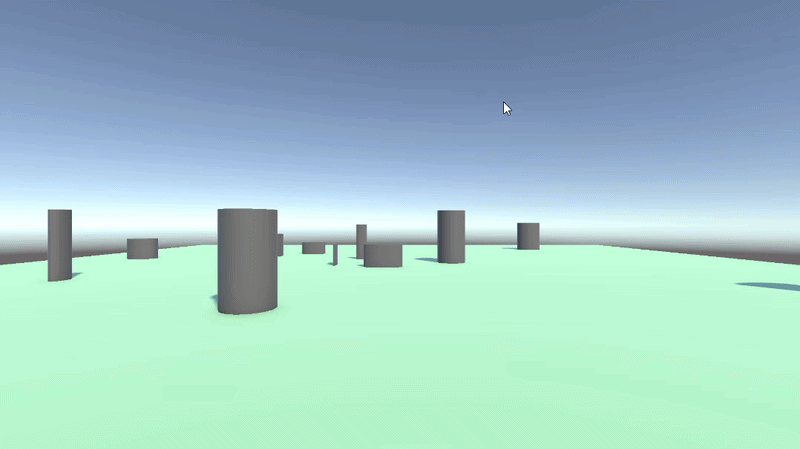

# M5 PROG

Les1:
-
Opdracht 1.1/1.11: 
[PROG c# recap script](https://github.com/Adem-ma/y2.2-programmington-les/blob/main/Prog%20UP/Assets/Scripts/PROG_Les1.cs)
-
Opdracht 1.12: 
[Tower behaviour script](https://github.com/Adem-ma/y2.2-programmington-les/blob/main/Prog%20UP/Assets/Scripts/TowerBehaviour.cs)
-
[Tower spawning script](https://github.com/Adem-ma/y2.2-programmington-les/blob/main/Prog%20UP/Assets/Scripts/TowerSpawner.cs)
-
